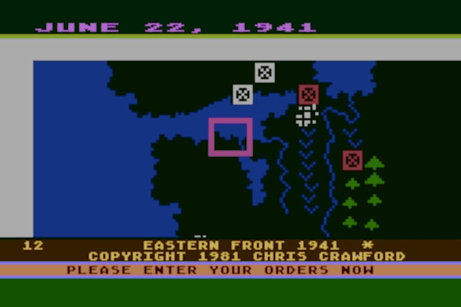
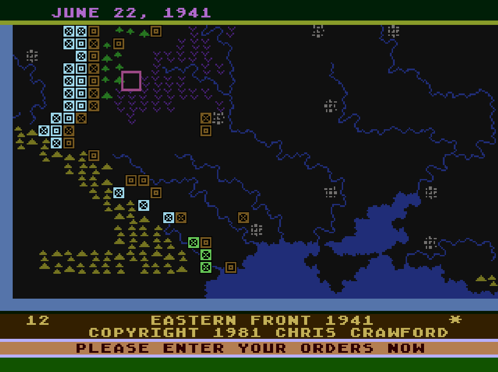

# Eastern Front (1941) - C256 Foenix Port

This is a port targeting the [Foenix Retro Systems C256](https://c256foenix.com/) platform.

---

Chris Crawford's original Atari 400/800 6502 assembly code, **migrated to the 64tass assembler**, for the classic game Eastern Front (1941).

This is mainly being released for historical reasons. This requires a copy of [64tass](https://sourceforge.net/projects/tass64/) to assemble.

Source has been modified extensively to support the Foenix platform.

